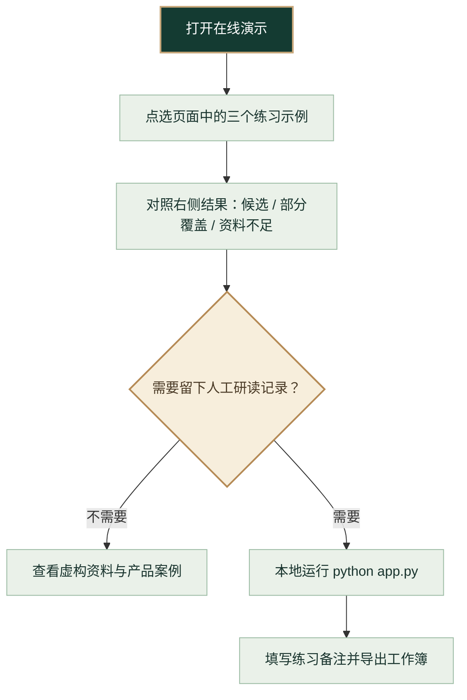

# 建筑规范检索助手 · 虚构资料演示版

这是一个建筑场景检索与人工研读工作流原型。当前公开版只使用[本项目原创虚构练习资料](data/demo-source.md)：14 个 D 编号条目，资料标识 `DEMO-ARCH-001`。它不是任何真实标准，不包含第三方规范原文、数值或要求，也不能用于设计、审查或合规判断。

**[立即在线试用虚构资料演示](https://ghgg25043-byte.github.io/building-code-assistant/)**：输入“办公楼公共走廊净宽和消防疏散距离有哪些要求？”，可看到虚构候选 D-11 与未覆盖的消防专题。在线演示只在浏览器中运行，不上传问题，也不调用模型。


*页面实拍：候选线索与资料缺口同时呈现。图中所有条目均为本项目原创虚构练习资料。*

[新手图解](docs/quickstart.md) · [静态流程导览](https://ghgg25043-byte.github.io/building-code-assistant/walkthrough.html) · [演示场景](docs/demo.md) · [产品案例](docs/case-study.md) · [评测说明](docs/evaluation.md) · [资料与权益边界](docs/data-sources.md) · [合规状态](COMPLIANCE_STATUS.md)

## 第一次使用：先走这条路线



想看带动效的版本，可打开[在线演示](https://ghgg25043-byte.github.io/building-code-assistant/)，依次点击三个示例，观察 D-11 候选、未覆盖专题提示和 0 候选；网页不会保存你的练习问题。需要记录理由与交接状态时，再按下方步骤运行本地版。每一步的页面位置和结果含义见[新手图解](docs/quickstart.md)。

## 本地运行

需要 Python 3.10 或更新版本，不需要安装第三方包。克隆仓库后在项目目录运行：

```bash
python app.py
```

打开 `http://127.0.0.1:8765`。Windows 可双击 `start.bat`。输入“办公楼公共走廊的净宽要求在哪里查”，可以观察虚构条目 D-11 的候选定位、未覆盖专题提示、人工备注和工作簿导出。真实项目请另行取得有权使用的现行正式规范资料，并由专业人员核验。

## 验证

```bash
python -m unittest discover -s tests -v
python evaluate.py
node tests/frontend_smoke.js
python scripts/build_pages_demo.py --check
node tests/pages_demo.js
```

开发者回归样本仅验证程序行为，不代表建筑专业准确率。可选模型接口默认关闭，只有使用者在单次检索中主动勾选才发送问题、项目条件与最多 3 条虚构候选主题；请勿输入客户或敏感资料。

## 授权与贡献

本项目原创代码、文档和虚构练习资料按 [MIT License](LICENSE) 发布。真实规范资料不包含在仓库内；新增真实资料前必须确认来源、权利、授权范围、现行版本和专业复核。详见[贡献说明](CONTRIBUTING.md)。
