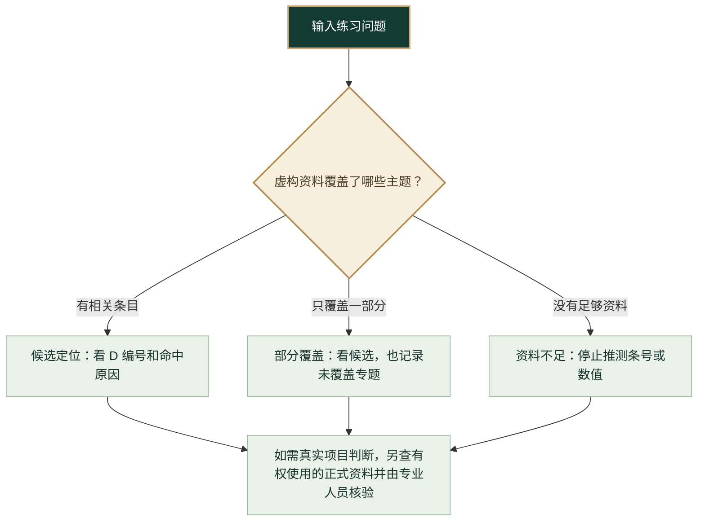

# 新手图解：先看结果，再决定是否本地记录

公开版只使用[原创虚构资料](../data/demo-source.md)，不对应任何真实规范或工程要求。第一次体验不需要安装软件或准备 API Key。

## 1. 在哪里输入、在哪里看结果

打开[在线演示](https://ghgg25043-byte.github.io/building-code-assistant/)。页面左侧是“练习问题”和可选的建筑用途标签；点击“检索虚构条目”，在右侧看结果状态。手机上输入区在上，结果区在下。页面左下方的三个示例按钮可以直接填入问题并检索。


页面只在浏览器内检索 14 个虚构条目，不保存练习问题。不要输入客户资料、真实图纸或个人敏感信息。

## 2. 三种结果分别意味着什么



按页面三个按钮依次试一次：

| 练习输入 | 预期看到 | 下一步 |
| --- | --- | --- |
| 办公楼公共走廊的净宽要求在哪里查？ | 1 条虚构候选 D-11 | 看命中原因和原创资料，不把它当成真实净宽要求 |
| 办公楼公共走廊净宽和消防疏散距离有哪些要求？ | D-11 与“消防专题未覆盖”提示 | 把未覆盖部分单独列为待查项 |
| 办公楼消防疏散距离要求是多少？ | 0 条候选 | 停止在资料缺口处，不猜数值 |

## 3. 需要写备注和导出工作簿时

在线演示只展示检索。要体验人工研读决定、交接状态和 Markdown 导出，使用 Python 3.10 或更新版本，在项目目录运行：

```bash
python app.py
```

打开 `http://127.0.0.1:8765`，再输入“办公楼公共走廊的净宽要求在哪里查？”。查看 D-11 后填写**练习理由**与**待核对条件**，设置交接状态，再导出工作簿。Windows 也可双击 `start.bat`。无须 API Key；模型外发默认关闭，只有单次主动勾选才会发出请求。

导出的记录仍只对应虚构资料。真实项目须另行取得有权使用的现行正式规范，并由专业人员核验。
